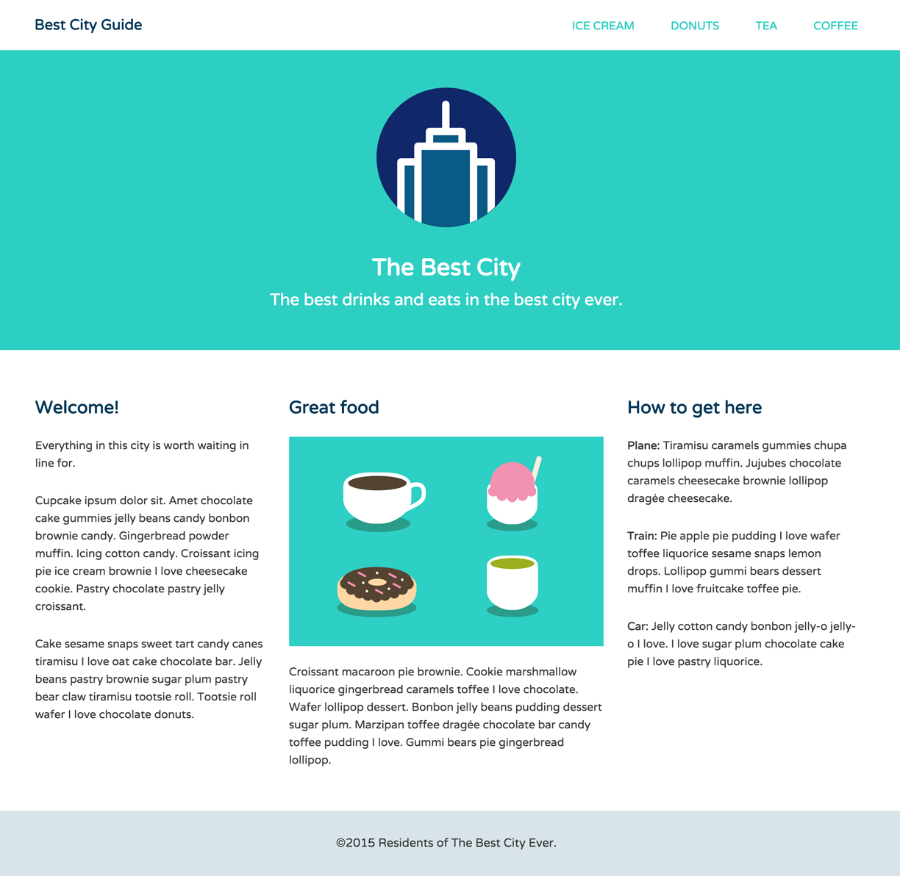

# Best City Guide

**Best City Guide** is a fully responsive website I built during May 2017 while completing the [CSS Layout Basics](https://teamtreehouse.com/library/css-layout-basics) course on Team Treehouse. It is designed to function as an attractive starting point for a website with a casual focus on local eatery.

Throughout the small project, I had the experience of building out a realized website based on a mockup design provided by the course, and managed to use web techniques such as fixed "sticky" footers, fixed headers, inline-block and float layout techniques, and absolute and relative positioning styles, as well as a mobile-first approach to responsive design.
